#  TLI493D-A2B6

##  Low Power 3D Hall Sensor with $I^2C$ Interface

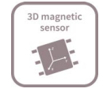

##  1 Overview

Quality Requirement Category: Industry

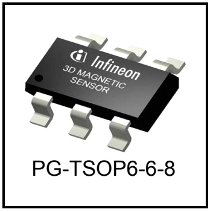

###  Features

● 3D magnetic flux density sensing of $\pm 160$ mT.

● Programmable flux resolution down to 65 μT (typ.).

● X-Y angular measurement mode

● Power down mode with 7 nA (typ) power consumption

● 12-bit data resolution for each measurement direction plus 10-bit temperature sensor

● Variable update frequencies and power modes (configurable during operation)

● Temperature range $T_i = -40^\circ C...105^\circ C$, supply voltage range = 2.8 V...3.5 V

● Triggering by external $\mu$C possible via $I^2C$ protocol

● Interrupt signal to indicate a valid measurement to the microcontroller

###  Applications

The TLI493D-A2B6 is designed for all kinds of sensing applications, including the following:

● Multi function knobs

● Joysticks and gimbals

● Anti tampering in smart meters

● White good applications (washing, dryer machines, ...)

• Robotics position sensing

###  Benefits

● Component reduction due to 3D magnetic measurement principle

● Wide application range addressable due to high flexibility

● Platform adaptability due to device configurability

● Disturbance of smaller stray fields are neglectable compared to the high magnetic flux measurement range

#  Overview

##  Table 1 Ordering Information

| Product Type | Marking | Ordering Code | Package | Default address write / read |
| --- | --- | --- | --- | --- |
| TLI493D-A2B6 | JA | SP001689844 | PG-TSOP6-6-8 | $ 6A_{\text{H}}/\text{6B}_{\text{H}} $ |

#  Table of Contents

1 Overview $\ldots$ 1

2Functional Description $\ldots$ 4

2.1 General $\ldots$ 4

2.1.1 Power mode control $\ldots$ 4

2.1.2 Sensing $\ldots$ 5

2.2 Pin Configuration (top view) $\ldots$ 5

2.3 Definition of Magnetic Field $\ldots$ 6

2.4 Sensitive Area $\ldots$ 6

2.5 Application Circuit $\ldots$ 7

3 Specification $\ldots$ 8

3.1Absolute Maximum Ratings $\ldots$ 8

3.2Operating Range $\ldots$ 9

3.3 Electrical Characteristics $\ldots$ 10

3.4 Magnetic Characteristics $\ldots$ 11

3.5 Temperature Measurement $\ldots$ 13

3.6 Overview of Modes $\ldots$ 14

3.7 Interface and Timing Description $\ldots$ 15

4Package Information $\ldots$ 17

4.1 Package Parameters $\ldots$ 17

4.2 Package Outlines $\ldots$ 18

5 Revision History $\ldots$ 20

#  Functional Description

##  2 Functional Description

This three dimensional Hall effect sensor can be configured by the microcontroller. The measurement data is provided in digital format to the microcontroller. The microcontroller is the master and the sensor is the slave.

###  2.1 General

Description of the Block diagram and its functions.

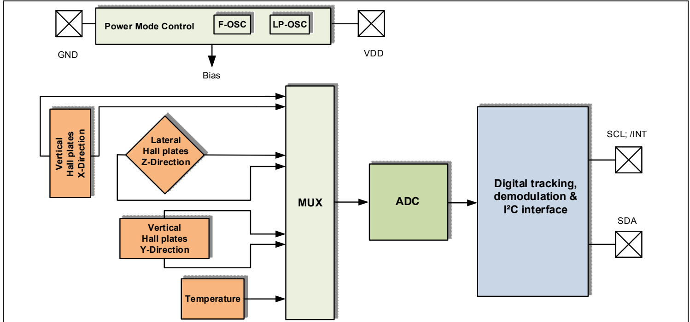

Figure 1 Block Diagram

The IC consists of three main functional units containing the following building blocks:

● The power mode control system, containing a low-power oscillator, basic biasing, accurate restart, undervoltage detection and a fast oscillator.

● The sensing unit, which contains the HALL biasing, HALL probes with multiplexers and successive tracking ADC, as well as a temperature sensor is implemented.

● The I$^{2}$C interface, containing the register files and I/O pads

###  2.1.1 Power mode control

The power mode control provides the power distribution in the IC, a power-on reset function and a specialized low-power oscillator as the clock source. It also manages the start-up behavior.

● On start-up, this unit:

- activates the biasing, provides an accurate reset detector and fast oscillator

- sensor enters low power mode and can be configured via $I^2C$ interface

● After re-configuration, a measurement cycle is performed, which consists of the following steps:

- activating internal biasing, checking for the restart condition and providing the fast oscillator

- HALL biasing

- measuring the three HALL probe channels sequentially (including the temperature). This is enabled by default

- reentering configured mode

#  Functional Description

In any case functions are only executed if the supply voltage is high enough, otherwise the restart circuit will halt the state machine until the required level is reached and restart afterwards. The functions are also restarted if a restart event occurs in between (see parameter ADC restart level).

##  2.1.2 Sensing

Measures the magnetic field in X, Y and Z direction. Each X-, Y- and Z-Hall probe is connected sequentially to a multiplexer, which is then connected to an Analog to Digital Converter (ADC). Optional, the temperature (default = activated) can be determined as well after the three Hall channels.

##  2.2 Pin Configuration (top view)

Figure 2 shows the pinout of the TLI493D-A2B6.

Figure 2 TLI493D-A2B6 pinout

Table 2 TSOP6 pin description and configuration (see Figure 2)

| Pin No. | Name | Description |
| --- | --- | --- |
| 1 | SCL/INT | Interface serial clock pin (input)Interrupt pin, signals a finished measurement cycle, open-drain |
| 2 | GND | Connect to GND |
| 3 | GND | Ground Pin |
| 4 | VDD | Supply Pin |
| 5 | GND | Connect to GND |
| 6 | SDA | Interface serial data pin (input/output), open-drain |

#  Functional Description

##  2.3 Definition of Magnetic Field

A positive field is considered as South-Pole facing the corresponding Hall element.

Figure 3 shows the definition of the magnetic directions X, Y, Z of the TLI493D-A2B6.

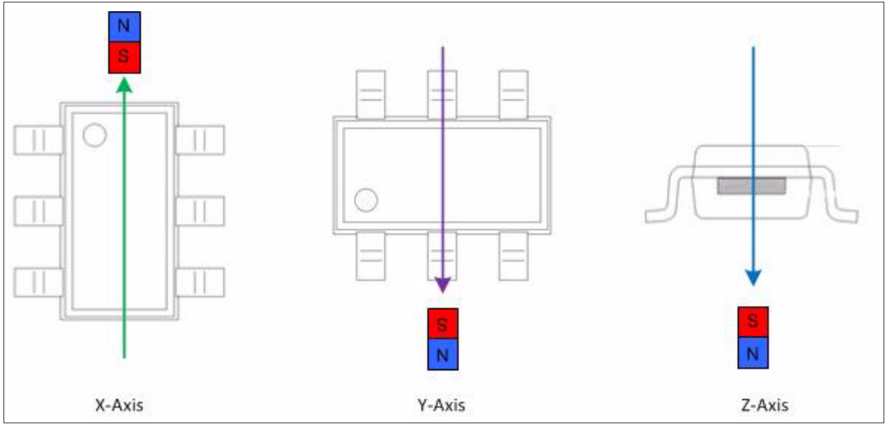

Figure 3 Definition of Magnetic Field Direction

##  2.4 Sensitive Area

The magnetic sensitive area for the Hall measurement is shown in Figure 4.

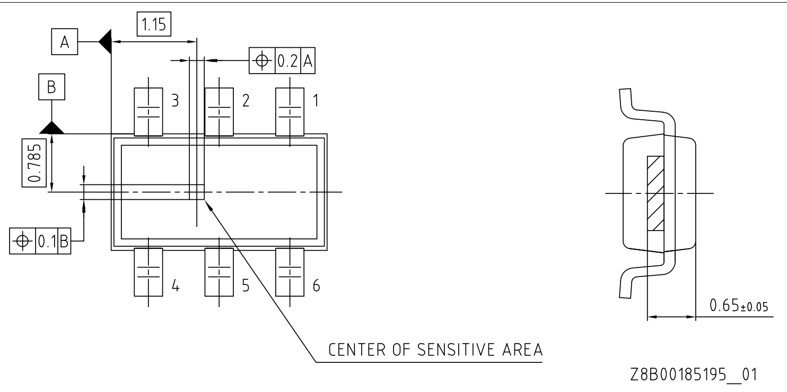

Figure 4

Center of Sensitive Area (dimensions in mm)

#  Functional Description

##  2.5 Application Circuit

The use of an interrupt line is optional, but highly recommended to ensure proper and efficient readout of the sensor data.

The pull-up resistor values of the I$^{2}$C bus have to be calculated in such a way as to fulfill the rise- and fall time specification of the interface for the given worst case parasitic (capacitive) load of the actual application setup.

Please note: too small resistive R1/2 values have to be prevented to avoid unnecessary power consumption during interface transmissions, especially for low-power applications.

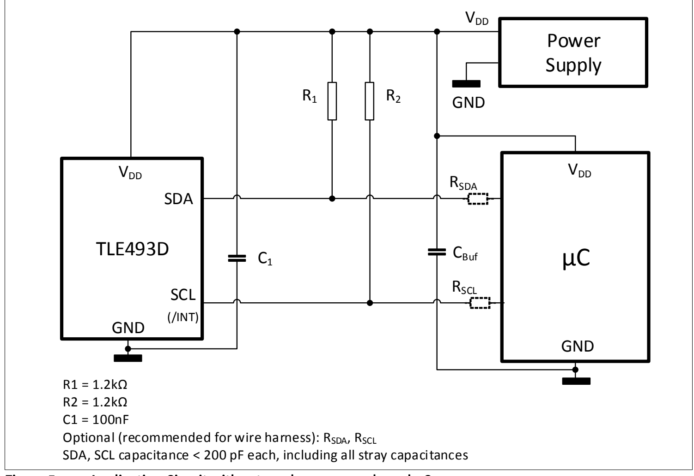

Figure 5 Application Circuit with external power supply and $\mu$C

For additional EMC precaution in harsh environments, $C_1$ may be implemented by two 100 nF capacitors in parallel, which should be already given by $C_{Buf}$ near the µC and/or power supply.

#  Specification

##  3 Specification

This sensor is intended to be used in an industrial environment. This chapter describes the environmental conditions required by the device (magnetic, thermal and electrical).

###  3.1 Absolute Maximum Ratings

Stresses above those listed under “Absolute Maximum Ratings” may cause permanent damage to the device. This is a stress rating only and functional operation of the device at these or any other conditions above those indicated in the operational sections of this specification is not implied. Furthermore, only single error cases are assumed. More than one stress/error case may also damage the device.

Exposure to absolute maximum rating conditions for extended periods may affect device reliability. During absolute maximum rating overload conditions the voltage on $V_{DD}$ pin with respect to ground (GND) must not exceed the values defined by the absolute maximum ratings.

Table 3 Absolute Maximum Ratings

| Parameter | Symbol | min | typ | max | Unit | Note/Condition |
| --- | --- | --- | --- | --- | --- | --- |
| Junction temperature | $T_{j}$ | -40 | - | 105 | °C |  |
| Voltage on $V_{DD}$ | $V_{DD}$ | -0.3 | - | 3.5 | V |  |
| Magnetic field | $B_{max}$ | - | - | ±1 | T |  |
| Voltage range on any pin to GND | $V_{max}$ | -0.1 | - | 3.5 | V | open-drain outputs are not current limited. |

Table 4 ESD Protection $^{1)}$

Ambient temperature $T_A = 25^\circ C$

| Parameter | Symbol | Values | Values | Values | Unit | Note or Test Condition |
| --- | --- | --- | --- | --- | --- | --- |
| Parameter | Symbol | Min. | Typ. | Max. | Unit | Note or Test Condition |
| ESD voltage $(HBM)^{2)}$ | $V_{ESD}$ | - | - | ±2.0 | kV | R = 1.5 kΩ, C = 100 pF |
| ESD voltage $(CDM)^{3)}$ | $V_{ESD}$ | - | - | ±0.75 | kV | for corner pins |
| ESD voltage $(CDM)^{3)}$ | $V_{ESD}$ | - | - | ±0.5 | kV | all pins |

1) Characterization of ESD is carried out on a sample basis, not subject to production test.

2) Human Body Model (HBM) tests according to ANSI/ESDA/JEDEC JS-001.

3) Charged Device Model (CDM), ESD susceptibility according to ANSI/ESDA/JEDEC JS-002.

#  Specification

##  3.2 Operating Range

To achieve ultra low power consumption, the chip does not use a conventional, power-consuming restart procedure. The focus of the restart procedure implemented is to ensure a proper supply for the ADC operation only. So it inhibits the ADC until the sensor supply is high enough.

##  Table 5 Operating Range

| Parameter | Symbol | min | typ | max | Unit | Note/Condition |
| --- | --- | --- | --- | --- | --- | --- |
| Operating temperature | $T_{j}$ | -40 | - | 105 | °C | $ T_j=T_a+3\text{ K in fast mode} $ |
| Supply voltage | $V_{DD}$ | 2.8 | 3.3 | 3.5 | V | Supply voltage must be above restart level |
| ADC restart level | $V_{res}$ | 2.2 | 2.5 | 2.8 | V | min. ADC operating level |
| ADC restart hysteresis | $V_{res-hys}$ | - | 50 | - | mV |  |
| Register stable level | $V_{reg}$ | - | - | 2.5 | V | Register values are stable above this voltage level |

The sensor relies on a proper supply ramp defined with $t_{PUP}$, $V_{OUS}$ and $I_{DD-PUP}$, see Figure 6. The I$^{2}$C reset feature of the sensor shall be used by the μC after Power Up. If supply monitoring is used in the system (e.g. brown-out detector etc.), it is also recommended to use the I$^{2}$C reset of the sensor following events detected by this monitor.

In any case, an external supply switch (either provided by a System-Basis-Chip solution which includes a supply-enable feature, a Bias-Resistor-Transistor device, a capable μC GPIO pin, etc.) shall allow a power-cycle of the sensor as backup for high availability applications to cope with any form of $V_{DD}$ ramps (including potential EMC influences), see Figure 6.

At Power Up, SDA and SCL shall be pulled to $V_{DD}$ using R1 and R2 of Figure 5 and not be driven to low by any device or μC on SDA and SCL.

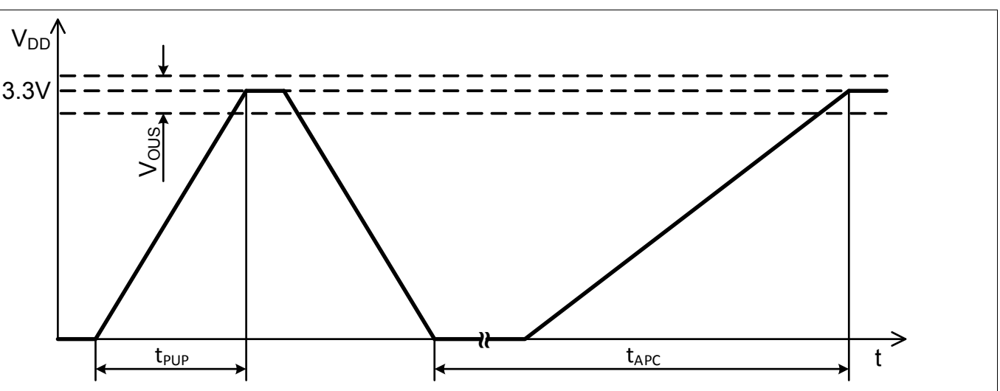

Figure 6 $V_{DD}$ power up and power-cycle for high availability

#  Specification

Table 6 $V_{DD}$ power up and power-cycle

| Parameter | Symbol | min | typ | max | Unit | Note/Condition |
| --- | --- | --- | --- | --- | --- | --- |
| Power Up ramp time | $t_{PUP}$ | - | - | 10 | μs |  |
| Availability power $cycle^{1)}$ | $t_{APC}$ | - | 150 | 400 | μs |  |
| Power Up over-undershoot | $V_{OUS}$ | 3 | 3.3 | 3.5 | V | Envelope which must not be exceeded at the end of a Power Up. |
| Power Up currentconsumption | $I_{DD-PUP}$ | - |  | 10 | mA | Current consumption during $t_{PUP}$ |

1) Not subject to production test - verified by design.

#  3.3 Electrical Characteristics

This sensor provides different operating modes and a digital communication interface. The corresponding electrical parameters are listed in Table 7. Regarding current consumption more information are available in Chapter 3.6.

Table 7 Electrical Setup

Values for $V_{DD} = 3.3$ V ±5 %, $T_j = -40°C$ to +105°C (unless otherwise specified)

| Parameter | Symbol | min | typ | max | Unit | Note/Condition |
| --- | --- | --- | --- | --- | --- | --- |
| Supply current $^{1)}$ | $I_{DD\_pd}$ | - | 7 | 130 | nA | $T_{j}$ = 25°C; power down mode |
| Supply current $^{1)}$ | $I_{DD\_fm}$ | 1 | 3.4 | 5 | mA | Fast mode |
| Input voltage low threshold $^{2)}$ | $V_{IL}$ | - | - | 30 | %$V_{DD}$ | all input pads |
| Input voltage high threshold $^{2)}$ | $V_{IH}$ | 70 | - | - | %$V_{DD}$ | all input pads |
| Input voltage hysteresis $^{2)}$ | $V_{IHYS}$ | 5 | - |  | %$V_{DD}$ | all input pads |
| Output voltage low level   3 mA load | $V_{OL}$ | - | - | 0.4 | V | all output pads, static load |

1) Currents at pull up resistors (Figure 5) needs to be considered for power supply dimensioning.

2) Based on $I^2C$ standard 1995 for $V_{DD}$ related input levels

#  Specification

##  3.4 Magnetic Characteristics

The magnetic parameters are specified for an end of line production scenario and for an application life time scenario.

The magnetic measurement values are provided in the two's complement with 12 bit or 8 bit resolution in the registers with the symbols Bx, By and Bz. Two examples, how to calculate the magnetic flux are shown in Table 11 and Table 12.

Table 8 Initial Magnetic Characteristics1)

Values for $T_j = +25^\circ C$, 0 h and $V_{DD} = 3.3$ V (unless otherwise specified)

| Parameter | Symbol | min | typ | max | Unit | Note/Condition |
| --- | --- | --- | --- | --- | --- | --- |
| Magnetic linear $range^{2)}$ (full range) | $B_{xyz_LIN}$ | ±160 | ±200 | ±230 | mT | -40°C < $T_{j}$ < +105°C |
| Magnetic linear $range^{2)3)}$ (short range) | $B_{xyz_LINSR}$ | ±100 | ±135 | ±150 | mT | -40°C < $T_{j}$ < +105°C |
| Sensitivity X, Y, Z (full range) | Sx, Sy, Sz | 5.5 | 7.7 | 10.5 | $LSB_{12}/$mT |  |
| Sensitivity X, Y, Z (short range) | $Sx_{SR},$ $Sy_{SR},$ $Sz_{SR}$ | 11 | 15.4 | 21 | $LSB_{12}/$mT |  |
| Z-Offset (full range and short range) | $B_{0Z}$ | -1.8 | ±0.2 | +1.8 | mT |  |
| XY-Offset (full range and short range) | $B_{0xy}$ | -0.75 | ±0.2 | +0.75 | mT |  |
| X to Y magnetic $matching^{4)}$ | $M_{XY}$ | -15 | ±1 | +15 | % | Up to min.$B_{xyz_LIN}$ or $B_{xyz_LINSR}$ |
| X/Y to Z magnetic $matching^{4)}$ | $M_{X/YZ}$ | -25 | 0 | +25 | % | Up to min.$B_{xyz_LIN}$ or $B_{xyz_LINSR}$ |
| Resolution, $12-bit^{5)}$ (full range) | $Res_{12}$ | 95 | 130 | 182 | $μT/LSB_{12}$ |  |
| Resolution, $12-bit^{5)}$ (short range) | $Res_{12_SR}$ | 47.5 | 65 | 91 | $μT/LSB_{12}$ |  |
| Resolution, $8-bit^{5)}$ (full range) | $Res_{8}$ | 1.52 | 2.08 | 2.91 | $mT/LSB_{8}$ |  |
| Resolution, $8-bit^{5)}$ (short range) | $Res_{8_SR}$ | 0.76 | 1.04 | 1.46 | $mT/LSB_{8}$ |  |
| Magnetic initial noise (rms) (full range and short range) | $B_{ineff}$ | - | 0.1 | 0.5 | mT | rms = 1 sigma |
| Magnetic hysteresis $^{2)}$ (full range and short range) | $B_{HYS}$ | - | 1 | - | $LSB_{12}$ | due to quantization effects |

1) Magnetic test on wafer level. It is assumed that initial variations are stored and compensated in the external $\mu C$ during module test and calibration.

2) Not subject to production test - verified by design/characterization.

3 ) The short range setting does not have an analogue saturation behavior due to internal offsets and the compensation thereof.

4) See the magnetic matching definition in Equation (3.1) and Equation (3.2).

5) Resolution is calculated as 1/Sensitivity (and multiplied by 16 for 8-bit value).

Equation for parameter “X to Y magnetic matching”: (3.1)

$$M_{XY} = 100 \cdot 2 \cdot \frac{Sx - Sy}{Sx + Sy} \left[ \% \right]$$

Equation for parameter “X/Y to Z magnetic matching”: (3.2)

$$M_{X/YZ} = 100 \cdot 2 \cdot \frac{Sx + Sy - 2 \cdot Sz}{Sx + Sy + 2 \cdot Sz} \quad [\%]$$

#  Specification

Table 9 Sensor Drifts1) valid for both full range and short range (unless indicated)

Values for $V_{DD} = 3.3$ V ±5 %, $T_j = -40°C$ to 105°C, static magnetic field within full magnetic linear range (unless otherwise specified)

| Parameter | Symbol | min | typ | max | Unit | Note/Condition |
| --- | --- | --- | --- | --- | --- | --- |
| Sensitivity drift X, Y, Z | $ S_{\text{D}},\text{Sy}_{\text{D}},\text{Sz}_{\text{D}} $ | -15 | ±5 | +15 | % | $TC_{0}$ |
| Offset drift X, Y | $B_{O\_ DXY}$ | -0.45 | - | +0.45 | mT | @ 0 mT, $TC_{0}$ |
| Offset drift Z | $B_{O\_ DZ}$ | -1.6 | - | +1.6 | mT | @ 0 mT, $TC_{0}$ |
| X to Y magnetic matching $drift^{2)}$ | $M_{XY\_D}$ | -3.5 | ±1 | +3.5 | % | $TC_{0}$ |
| X/Y to Z magnetic matching $drift^{2)}$ | $ M_{\text{X/YZ\_D}} $ | -15 | ±10 | +15 | % | $TC_{0}$ |

1) Not subject to production test, verified by design/characterization. Drifts are changes from the initial characteristics due to external influences.

2) See the magnetic matching definition in Equation (3.1) and Equation (3.2).

Table 10 Temperature compensation, non-linearity and noise$^{1)}$

Values for $V_{DD} = 3.3$ V ±5 %, $T_j = -40°C$ to 105°C (unless otherwise specified)

| Parameter | Symbol | min | typ | max | Unit | Note/Condition |
| --- | --- | --- | --- | --- | --- | --- |
| Temperature $compensation^{2)}$(full range and short range) | $TC_{0}$ | - | ±0 | - | ppm/K | Bx, By and Bz (default) |
| Temperature $compensation^{2)}$(full range and short range) | $TC_{1}$ | - | -750 | - | ppm/K | Bx, By and Bz (option 1) |
| Temperature $compensation^{2)}$(full range and short range) | $TC_{2}$ | - | -1500 | - | ppm/K | Bx, By and Bz (option 2) |
| Temperature $compensation^{2)}$(full range and short range) | $TC_{3}$ | - | +350 | - | ppm/K | Bx, By and Bz (option 3) |
| Differential Non Linearity (full range) | DNL | - | ±2 | - | $LSB_{12}$ | Bx, By and Bz |
| Differential Non Linearity (short range) | $DNL_{SR}$ | - | ±4 | - | $LSB_{12}$ | Bx, By and Bz |
| Integral Non Linearity (full range) | INL | - | ±2 | - | $LSB_{12}$ | Bx, By and Bz |
| Integral Non Linearity (short range) | $INL_{SR}$ | - | ±4 | - | $LSB_{12}$ | Bx, By and Bz |
| Magnetic noise (rms) | $B_{Neff}$ | - | - | 1 | mT | rms = 1 sigma |
| Z-Magnetic noise (rms) | $B_{NeffZ}$ | - | - | 0.5 | mT | rms = 1 sigma,-40°C < $T_{j}$ < +85°C |
| XY-Magnetic noise (rms) | $B_{NeffXY}$ | - | - | 0.25 | mT | rms = 1 sigma,-40°C < $T_{j}$ < +85°C |

1) Not subject to production test, verified by design/characterization.

2) $TC_X$ must be set before magnetic flux trimming and measurements with the same value.

#  Specification

##  Conversion register value to magnetic field value:

###  Table 11 Magnetic conversion table for 12Bit

|  | MSB | Bit10 | Bit9 | Bit8 | Bit7 | Bit6 | Bit5 | Bit4 | Bit3 | Bit2 | Bit1 | LSB |
| --- | --- | --- | --- | --- | --- | --- | --- | --- | --- | --- | --- | --- |
| [Dec] | -2048 | 1024 | 512 | 256 | 128 | 64 | 32 | 16 | 8 | 4 | 2 | 1 |
| [Bin] e.g. | 1 | 1 | 1 | 1 | 0 | 0 | 0 | 0 | 1 | 1 | 1 | 1 |

The conversion is realized by the two's complement. Please use following table for transformation:

Example for 12-bit read out: 1111 0000 $1111_B$: -2048 + 1024 + 512 + 256 + 0 + 0 + 0 + 0 + 8 + 4 + 2 + 1 = -241 $LSB_{12}$
Calculation of magnetic flux: -241 $LSB_{12}$ * 0.13 mT/$LSB_{12}$ = -31.3 mT

###  Table 12 Magnetic conversion table for 8Bit

|  | MSB | Bit10 | Bit9 | Bit8 | Bit7 | Bit6 | Bit5 | LSB |
| --- | --- | --- | --- | --- | --- | --- | --- | --- |
| [Dec] | -128 | 64 | 32 | 16 | 8 | 4 | 2 | 1 |
| [Bin] e.g. | 0 | 1 | 0 | 1 | 1 | 1 | 0 | 1 |

Example for 8-bit read out: 0101 $1101_{B}$: 0 + 64 + 0 + 16 + 8 + 4 + 0 + 1 = 93 $LSB_{8}$

Calculation of magnetic flux: 93 LSB$_{8}$ * 2.08 mT/LSB$_{8}$ = 193.4 mT

###  3.5 Temperature Measurement

By default, the temperature measurement is activated. The temperature measurement can be disabled if it is not needed and to increase the speed of repetition of the magnetic values.

#  Table 13 Temperature Measurement Characteristics$^{1)}$

| Parameter | Symbol | min | typ | max | Unit | Note/Condition |
| --- | --- | --- | --- | --- | --- | --- |
| Digital value   25°C | $T_{25}$ | 1000 | 1180 | 1360 | $LSB_{12}$ |  |
| Temperature resolution, 12-bit | $T_{Res12}$ | 0.21 | 0.24 | 0.27 | $K/LSB_{12}$ | referring to $T_{j}$ |
| Temperature resolution, 8-bit | $T_{Res8}$ | - | 3.84 | - | $K/LSB_{8}$ | referring to $T_{j}$ |

1) The temperature measurement is not trimmed on the sensor. An external $\mu$C can measure the sensor during module production and implement external trimming to gain higher accuracies.

Temperature values are based on 12 bit resolution. Please note: only bit 11 ... 2 are listed in the bitmap registers.

##  Table 14 Temperature conversion table for 12Bit

The bits MSB to Bit2 are read out from the temperature value registers. Bit1 and LSB are added to get a 12-bit value for calculation.

|  | MSB | Bit10 | Bit9 | Bit8 | Bit7 | Bit6 | Bit5 | Bit4 | Bit3 | Bit2 |
| --- | --- | --- | --- | --- | --- | --- | --- | --- | --- | --- |
| [Dec] | -2048 | 1024 | 512 | 256 | 128 | 64 | 32 | 16 | 8 | 4 |
| [Bin] e.g. | 0 | 1 | 0 | 1 | 0 | 0 | 1 | 0 | 1 | 1 |

Example for 12-bit calculation: 0110 1010 $11_B$: $0 + 1024 + 0 + 256 + 0 + 0 + 32 + 0 + 8 + 4 = 1324 \text{ LSB}_{12}$

Calculation to temperature: (1324 LSB12 - 1180 LSB12) * 0.24 K/LSB12 + 25°C ≈ 60°C

#  Specification

##  3.6 Overview of Modes

For a good adaptation on application requirements this sensor is equipped with different modes. An overview is listed in Table 15.

##  Table 15 Overview of modes1)

| Mode | Measurements | Typ. $f_{Update}^{2)}$ | Description |
| --- | --- | --- | --- |
| Power Down | No measurements | - | Lowest possible supply current $I_{DD}.$ |
| Low Power Mode (full range and short range) | Bx, By, Bz, T | 10 Hz or 160 Hz | Cyclic measurements and ADC-conversions with different update rates. |
| Low Power Mode (full range and short range) | Bx, By, Bz | 10 Hz or 160 Hz | Cyclic measurements and ADC-conversions with different update rates. |
| Low Power Mode (full range and short range) | Bx, By | 10 Hz or 160 Hz | Cyclic measurements and ADC-conversions with different update rates. |
| Fast Mode (full range) | Bx, By, Bz, T | 5.7 kHz | Measurements and ADC conversions are running continuously. An I$^{2}$C clock speed ≥ 800 kHz and use of the interrupt /INT is required. |
| Fast Mode (full range) | Bx, By, Bz | 7.5 kHz | Measurements and ADC conversions are running continuously. An I$^{2}$C clock speed ≥ 800 kHz and use of the interrupt /INT is required. |
| Fast Mode (full range) | Bx, By | 8.4 kHz | Measurements and ADC conversions are running continuously. An I$^{2}$C clock speed ≥ 800 kHz and use of the interrupt /INT is required. |
| Fast Mode (short range) | Bx, By, Bz, T | 4.2 kHz | Measurements and ADC conversions are running continuously. An I$^{2}$C clock speed ≥ 800 kHz and use of the interrupt /INT is required. |
| Fast Mode (short range) | Bx, By, Bz | 5.5 kHz | Measurements and ADC conversions are running continuously. An I$^{2}$C clock speed ≥ 800 kHz and use of the interrupt /INT is required. |
| Fast Mode (short range) | Bx, By | 6.2 kHz | Measurements and ADC conversions are running continuously. An I$^{2}$C clock speed ≥ 800 kHz and use of the interrupt /INT is required. |
| Master-Controlled Mode (full range and short range) | Bx, By, Bz, T | Up to Fast Mode values. | Measurements triggered by the microcontroller via I$^{2}$C. |
| Master-Controlled Mode (full range and short range) | Bx, By, Bz | Up to Fast Mode values. | Measurements triggered by the microcontroller via I$^{2}$C. |
| Master-Controlled Mode (full range and short range) | Bx, By | Up to Fast Mode values. | Measurements triggered by the microcontroller via I$^{2}$C. |

1) Not subject to production test - verified by design/characterization.

2) This is the frequency at which specified measurements are updated.

$I^2C$ triggered Master-Controlled Mode typical $I_{DD}$ current consumption estimation formula:

$$ \text{Equation } I_{\text{DD}}\text{ full range} \qquad (3.3) $$

$$I_{DD}\approx I_{DD\_ fm}\cdot 0.18\, ms\cdot f_{Update}$$

$$ \text{Equation } I_{\text{DD}}\text{ short range} \qquad (3.4) $$

$$I_{DD}\approx I_{DD\_ fm}\cdot 0.24\, ms\cdot f_{Update}$$

The average supply current $I_{DD}$ in the 2 Low Power Modes and $I^2C$ triggered mode will decrease by about 25 % if the temperature measurement is disabled and will decrease by about 50 % if the temperature and Bz measurement is disabled.

#  Specification

##  3.7 Interface and Timing Description

This chapter refers to how to set the boundary conditions in order to establish a proper interface communication.

Table 16 Interface and timing1)

| Parameter | Symbol | min | typ | max | Unit | Note/Condition |
| --- | --- | --- | --- | --- | --- | --- |
| End of Conversion /INT pulse | $t_{INT}$ | 1.8 | 2.5 | 3.2 | μs | low-active (when activated) |
| Time window to read first value (full range) | $t_{RD1}$ | 30 | 40 | 50 | μs | read after rising /INT edge |
| Time window to read first value (short range) | $t_{RD1_SR}$ | 42 | 56 | 70 | μs | read after rising /INT edge |
| Time window to read next value (full range) | $t_{RDn}$ | 32 | 43 | 54 | μs | consecutive reads |
| Time window to read next value (short range) | $t_{RDn_SR}$ | 44 | 59 | 74 | μs | consecutive reads |
| Internal clock accuracy | $t_{clk_E}$ | -25 | - | +25 | % |  |
| $I^{2}C$ timings | $I^{2}C$ timings | $I^{2}C$ timings | $I^{2}C$ timings | $I^{2}C$ timings | $I^{2}C$ timings | $I^{2}C$ timings |
| Allowed $I^{2}C$ bit clock $frequency^{2)}$ | $f_{I2C_CLK}$ | - | 400 | 1000 | kHz |  |
| Low period of SCL clock | $t_{L}$ | 0.5 | - | - | μs | 1.3 μs for 400-kHz mode |
| High period of SCL clock | $t_{H}$ | 0.4 | - | - | μs | 0.6 μs for 400-kHz mode |
| SDA fall to SCL fall hold time (hold time start condition to clock) | $t_{STA}$ | 0.4 | - | - | μs | 0.6 μs for 400-kHz mode |
| SCL rise to SDA rise su. time (setup time clock to stop condition) | $t_{STOP}$ | 0.4 | - | - | μs | 0.6 μs for 400-kHz mode |
| SDA rise to SDA fall hold time (wait time from stop to start cond.) | $t_{WAIT}$ | 0.4 | - | - | μs | 0.6 μs for 400-kHz mode |
| SDA setup before SCL rising | $t_{SU}$ | 0.1 | - | - | μs |  |
| SDA hold after SCL falling | $t_{HOLD}$ | 0 | - | - | μs |  |
| Fall time SDA/SCL $signal^{3)}$ | $t_{FALL}$ | - | 0.25 | 0.3 | μs |  |
| Rise time SDA/SCL $signal^{3)}$ | $t_{RISE}$ | - | 0.5 | - | μs | R = 1.2 kΩ |

1) Not subject to production test - verified by design/characterization

2) Dependent on R-C-combination on SDA and SCL. Ensure reduced capacitive load for speeds above 400 kHz.

3) Dependent on used R-C-combination.

The fast mode, shown in Figure 7, requires a very strict $I^2C$ behavior synchronized with the sensor conversions and high bit rates. In this mode, a fresh measurement cycle is started immediately after the previous cycle was completed.

Other modes are available for more relaxed timing and also for a synchronous microcontroller operation of sensor conversions. In these modes, a fresh measurement cycle is only started if it is triggered by an internal or external trigger source.

In the default measurement configuration (Bx, By, Bz and T), shown in Figure 7, the measurement cycle ends after the temperature measurement.

In 3-channel measurement configuration (Bx, By and Bz), the temperature channel is not converted and updated. Thus, the measurement cycle ends after the Bz measurement.

#  Specification

In X/Y angular measurement configuration (Bx and By), the Bz and temperature channel are not converted and updated. Thus, the measurement cycle ends after the By measurement.

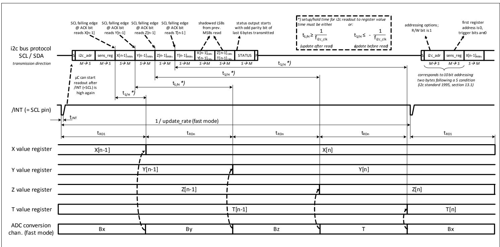

Figure 7 I$^{2}$C readout frame, ADC conversion and related timing

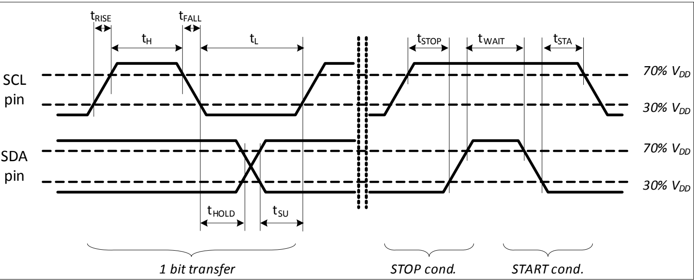

Figure 8 I$^{2}$C timing specification

#  Package Information

##  4

##  Package Information

###  4.1

###  Package Parameters

####  Table 17 Package Parameters

| Parameter | Symbol | Limit Values | Limit Values | Limit Values | Unit | Notes |
| --- | --- | --- | --- | --- | --- | --- |
| Parameter | Symbol | Min. | Typ. | Max. | Unit | Notes |
| Thermal resistance1)Junction ambient | $R_{thJA}$ | - | - | 200 | K/W | Junction to airfor PG-TSOP-6-6-8 |
| Thermal resistanceJunction lead | $R_{thJL}$ | - | - | 100 | K/W | Junction to leadfor PG-TSOP-6-6-8 |
| Soldering moisture level2) | MSL 1 | MSL 1 | MSL 1 | MSL 1 | MSL 1 | 260°C |

1) According to Jedec JESD51-7

2) Suitable for reflow soldering with soldering profiles according to JEDEC J-STD-020D.1 (March 2008)

Figure 9 Image of TLI493D-A2B6 in TSOP6

Figure 10 Footprint PG-TSOP6-6-8 (compatible to PG-TSOP6-6-5, all dimensions in mm)

#  Package Information

##  4.2 Package Outlines

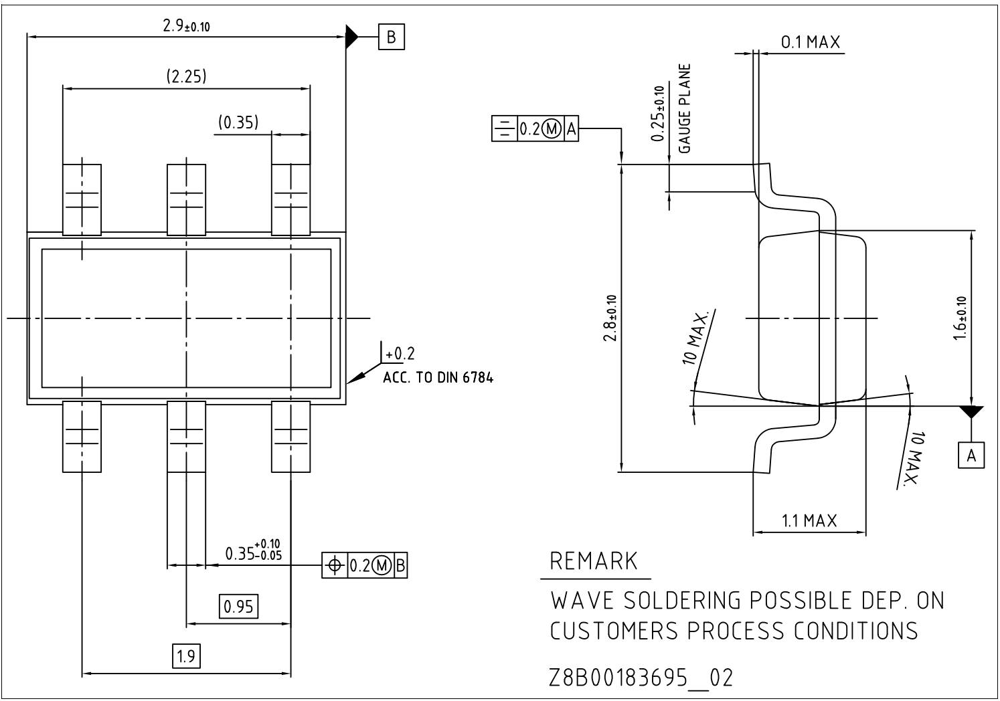

Figure 11 Package Outlines (all dimensions in mm)

#  Package Information

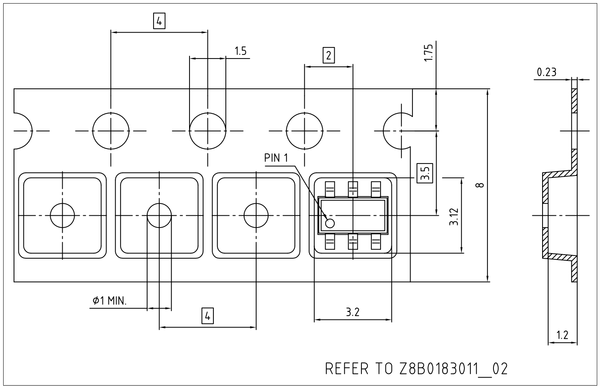

Figure 12 Packing (all dimensions in mm)

Further information about the package can be found here:

http://www.infineon.com/cms/packages/SMD - Surface_Mounted_Devices/TSOP/TSOP6.html

#  5 Revision History

##  Revision History

| Page or Item | Subjects (major changes since previous revision) |
| --- | --- |
| Ver. 1.3, 2019-04-09 | Ver. 1.3, 2019-04-09 |
|  | Chapter 3.2 text “I$^{2}$C reset” updated. |
| Ver. 1.2, 2019-02-08 | Ver. 1.2, 2019-02-08 |
|  | Figure 4, Figure 11 and Figure 12 updated. |
| Ver. 1.1, 2018-05-03 | Ver. 1.1, 2018-05-03 |
|  | Table 9 updated. |
| Ver. 1.0, 2018-04-10 | Ver. 1.0, 2018-04-10 |
|  | Initial version |

#  Trademarks

All referenced product or service names and trademarks are the property of their respective owners.

Edition 2019-04-09

Published by

Infineon Technologies AG

81726 Munich, Germany

©2019 Infineon Technologies AG.

All Rights Reserved.

Do you have a question about any aspect of this document?

Email: erratum@infineon.com

Document reference

#  IMPORTANT NOTICE

The information given in this document shall in no event be regarded as a guarantee of conditions or characteristics ("Beschaffenheitsgarantie").

With respect to any examples, hints or any typical values stated herein and/or any information regarding the application of the product, Infineon Technologies hereby disclaims any and all warranties and liabilities of any kind, including without limitation warranties of non-infringement of intellectual property rights of any third party.

In addition, any information given in this document is subject to customer's compliance with its obligations stated in this document and any applicable legal requirements, norms and standards concerning customer's products and any use of the product of Infineon Technologies in customer's applications.

The data contained in this document is exclusively intended for technically trained staff. It is the responsibility of customer's technical departments to evaluate the suitability of the product for the intended application and the completeness of the product information given in this document with respect to such application.

For further information on technology, delivery terms and conditions and prices, please contact the nearest Infineon Technologies Office (www.infineon.com).

#  WARNINGS

Due to technical requirements products may contain dangerous substances. For information on the types in question please contact your nearest Infineon Technologies office.

Except as otherwise explicitly approved by Infineon Technologies in a written document signed by authorized representatives of Infineon Technologies, Infineon Technologies' products may not be used in any applications where a failure of the product or any consequences of the use thereof can reasonably be expected to result in personal injury.
